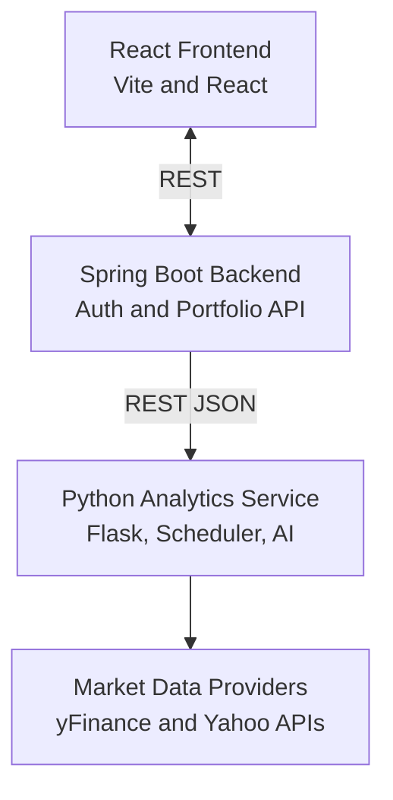

# OptiWealth – Architecture & Design Overview

This document describes the system design: components, data flows, technology choices, and rationale.

---
## 1. Goals & Non-Functional Requirements

Goals:
- Provide analytics (risk, optimization, forecasting) for portfolios
- Modular separation (UI, orchestration, analytics computation)
- Enable independent scaling of analytics microservice

Non-Functional Requirements:
- Scalability: Python analytics deploys separately
- Maintainability: Layered modules with clear responsibility
- Extensibility: Add new analytical models without changing orchestration
- Security: JWT-based auth, secret isolation

---
## 2. High-Level Component Diagram

PostgreSQL connects to the backend via JPA/Hibernate.

---
## 3. Module Breakdown

### Frontend (React + Vite)
- Login, portfolio visualization, analytics dashboards
- Protected routes and REST calls to backend

### Backend (Spring Boot)
- Authentication & JWT issuance
- Portfolio CRUD
- Forwards analytics requests to Python microservice
- Aggregates and returns combined responses

### Python Analytics Microservice
- Market data retrieval (`data_fetcher.py`)
- Descriptive metrics (`descriptive_metrics.py`)
- Risk diagnostics (`risk_diagnostics.py`)
- Forecasting (ARIMA, GARCH, Monte Carlo) (`forecasting_models.py`)
- Optimization (`optimization_engine.py`)
- Report assembly (`report_generator.py`)
- AI summary (`NLP_layer/gemini.py`)
- Scheduled Top Picks (`top_picks/`)

Design Notes:
- Each file represents a logical layer
- AI summary appended after quantitative computations

---
## 4. Data Flow (Portfolio Analysis)
1. Frontend submits holdings.
2. Backend validates and forwards JSON to Python `/analyze-portfolio`.
3. Python service normalizes symbols, gathers historical data, computes metrics, risk, forecasts, optimization, AI summary.
4. Response returned to backend then to frontend.

Failure Handling:
- Individual model errors produce null/NaN values without aborting overall response
- AI summary failure returns fallback text

---
## 5. Domain Model (Backend)
Entities:
- User (credentials, roles)
- Portfolio (owner, set of holdings)
- Holding (symbol, quantity, average cost)

Relations:
- User → Portfolios (1..*)
- Portfolio → Holdings (1..*)

---
## 6. API Interaction
Style: REST + JSON.
- JWT-secured backend endpoints
- Backend ↔ Python via HTTP POST/GET

Initial choice: REST for simplicity and broad tool compatibility.

---
## 7. Technology Rationale
Spring Boot:
- Mature stack for web, security, persistence

Python stack:
- Libraries for quantitative finance and statistics

React + Vite:
- Fast development cycle, modern build

PostgreSQL:
- ACID transactional store for portfolios

Gemini:
- Generates explanatory summaries

APSheduler:
- Lightweight in-process scheduling

---
## 8. Cross-Cutting Concerns
Security:
- JWT secret externalized; symbols checked against whitelist
Performance:
- Computational parts isolated in Python service
Resilience:
- Non-critical failures (e.g., AI summary) do not block analytics
Observability:
- Logs in each layer (extendable for structured logging)

---

## 9. Glossary
- VaR: Value at Risk
- CVaR: Conditional Value at Risk
- Sharpe Ratio: Return per unit of risk (volatility)
- Efficient Frontier: Set of optimal risk/return portfolios
- Beta: Sensitivity to benchmark movement
- Max Drawdown: Largest peak-to-trough decline

---
For operational instructions see `RUNNING.md`.
