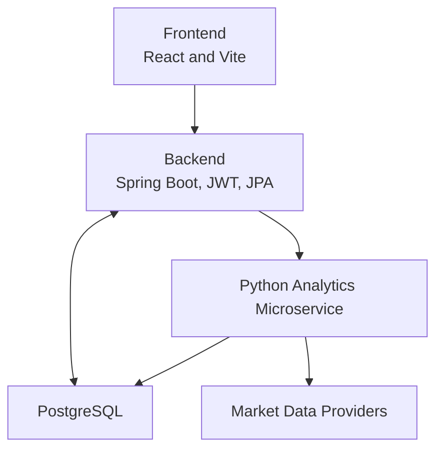

<div align="center">

# 💹 OptiWealth

### *An advanced, AI-powered portfolio analytics & optimization platform*


</div>

---

## 🚀 Overview

**OptiWealth** is a full-stack quantitative portfolio management and analytics platform designed to bring *institution-grade analytics* to modern web applications. It seamlessly integrates a **Spring Boot backend**, a **Python-based quantitative analytics microservice**, and a **React + Vite frontend**, delivering deep insights into portfolio performance, risk, forecasting, and optimization — enhanced with **AI-generated investment narratives**.

Whether you're analyzing returns, stress-testing risk, simulating future price paths, or constructing optimal portfolios, **OptiWealth** provides a clean, scalable, and extensible architecture to do it all.

---

## ✨ Key Features

### 📊 Portfolio Management

* Multiple portfolios per user
* Holdings tracking & real-time P&L
* Secure JWT-based authentication

### 📈 Descriptive Analytics

* Returns & cumulative returns
* Volatility analysis
* Sharpe ratio & performance diagnostics

### ⚠️ Risk Analytics

* Value at Risk (VaR)
* Conditional VaR (CVaR)
* Beta & market exposure
* Maximum drawdown
* Diversification score

### 🔮 Forecasting & Simulation

* ARIMA-based price trend forecasting
* GARCH volatility modeling
* Monte Carlo price path simulations

### 🧮 Portfolio Optimization

* Efficient frontier simulation
* Maximum Sharpe ratio portfolio
* Minimum volatility portfolio
* CVaR-based risk estimation

### 🤖 AI-Powered Insights

* Natural-language investment summaries using **Google Gemini**
* Quant metrics translated into intuitive narratives

### ⏱️ Automation

* Scheduled daily analytics for top market picks using **APScheduler**

---

## 🧱 Tech Stack

### Backend

* **Java 17**, **Spring Boot 3**
* Spring Security (JWT Authentication)
* Spring Data JPA
* PostgreSQL

### Analytics Microservice

* **Python**, Flask
* pandas, numpy
* statsmodels, arch
* yfinance
* APScheduler
* google-genai

### Frontend

* React + TypeScript
* Vite

### Database

* PostgreSQL

---

## 🏗️ System Architecture



### Design Highlights

* Backend persists all domain data and handles authentication
* Python microservice is **stateless** and computation-focused
* Analytics results returned as **structured JSON** enriched with AI narratives
* Clean separation of concerns for scalability and extensibility

---

## 🔄 Analytics Flow

1. User submits portfolio holdings from the frontend
2. Backend validates authentication and request payload
3. Backend forwards request to Python `/analyze-portfolio`
4. Python service performs:

   * Analytics
   * Risk diagnostics
   * Forecasting & simulations
   * Optimization
   * AI narrative generation
5. Consolidated JSON response returned to backend and delivered to frontend

---

## ⚙️ Configuration

> 🔒 Secrets and environment-specific values are **not committed**.

### Backend

* Create `application-local.properties` from the provided example

### Python Microservice

* Create `.env` file with:

  ```
  GOOGLE_API_KEY=your_api_key_here
  ```

### Frontend

* Optional `.env` for:

  ```
  VITE_API_BASE=http://localhost:8080
  ```

---

## ⚡ Quick Start

### Backend (Port 8080)

```bash
./mvnw spring-boot:run
```

### Python Analytics Service (Port 8000)

```bash
python microservice-python/controller.py
```

### Frontend (Port 5173)

```bash
cd frontend-react
npm install
npm run dev
```

---

## 📄 Documentation

* 📘 **Setup & Execution:** `RUNNING.md`
* 🏛️ **System Design:** `ARCHITECTURE.md`

---

## 🛡️ License

This project is licensed under the terms specified in the **LICENSE** file.

---

<div align="center">

### ⭐ If you find this project useful, consider starring the repository!

</div>
